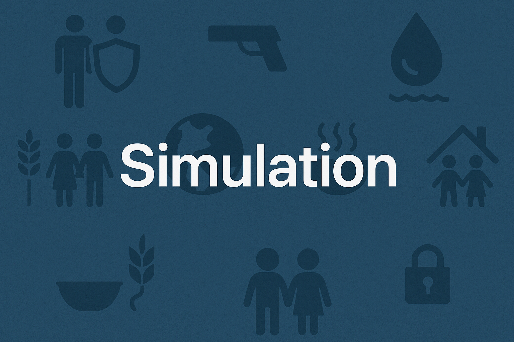

# UN Peacekeeper Simulation

## Overview

For this simulation, a case-based approach will be utilized. By using the evaluation metrics that are below, players will be able to understand, analyze, and then recommend whether an international conflict meets the criteria or has the ability to have a United Nations peacekeeping mission deployed to the conflict's area of operation. A United Nations peacekeeping mission is defined as “a deployment of military and civilian personnel by the United Nations to help countries transition from conflict to peace. These missions provide security, political support, and peacebuilding assistance to support countries in their early transition from conflict.”(Vision of Humanity, 2020) UN peacekeeping missions  allow conflicts around the world to come to an end and provide a sense of stability 

Players of this simulation will be able to recommend on whether a conflict is able to have a UN peacekeeping mission through three different and nuanced scenarios. The first scenario is the conflict in Cyprus. This conflict addresses the fighting between the Greek Cypriot and Turkish Cypriot communities and their armed fighting during the 1960’s and 1970’s. The second scenario will be the conflict in South Sudan. In 2011 South Sudan broke away from Sudan proper and became the world's newest country. This was a dangerous civil war that broke out from this conflict. The final scenario will be a hypothetical China vs Taiwan conflict. This will have the Chinese make the first move in the conflict and push the Taiwanese to defend themselves. Allies, especially the United States, come to the aid of Taiwan and a proxy war ensues. 

## Key Stakeholders 

Identifying all necessary and relevant parties to United Nations peacekeeping missions and operations allows one to understand the complexity, the nuances, countries and agencies as well as approvals that are needed to initiate a UN peacekeeping mission. The United Nations identified five different stakeholders that are relevant to the UN peacekeeping mission process. First, the United Nations states that all relevant United Nation actors are key stakeholders. This includes the United Nations Security Council, which has the authority to initiate a peacekeeping mission, 15 countries are members of this Council and can vote on whether to have a peacekeeping mission. However, the permanent Security Council members, the United states, China, France,the  United Kingdom, and Russia can veto any potential measure. Secondly the potential host government and the parties on the ground are key stakeholders for peacekeeping missions due to the host government and or parties on the ground have to be willing to allow a peacekeeping mission to occur. Thirdly, states that may contribute troops and police forces to a peace operation are key stakeholders. Countries throughout the UN contribute their soldiers ( enlisted and officer) as well as police forces to staff a peacekeeping mission and be the boots on the ground to ensure peace in the area of operation. Fourthly another key stakeholder that is identified is regional and intergovernmental organizations. For example this may include The African Union and European Union, as UN peacekeeping missions may interact with these international organizations, especially in conflicts that spill over into multiple states. Fifthly, the UN states that key external partners may be relevant stakeholders, this may include humanitarian-focused groups such as the Red Cross or World Food Bank (WFB). 

## Objectives

Having clear learning outcomes and expected outcomes of this simulation allows the player to know what they should be looking for and what lessons they can learn from completing the simulation. After playing through our three scenarios in the simulation plays should be able to achieve the following learning and simulation outcomes: 

### Four Learning Outcomes 

- Learn how and why a UN peacekeeping mission can be created 
- Understand international relations and alliances and how they affect sending in peacekeepers 
- Develop an understanding of the Security Council and the importance of the five permanent members
- Be able to explain what a proxy conflict is and how it affects regional stability. 

### Four Simulation Outcomes 
- Creating a stable and secure environment that promote a long-term sustainable peace
- Foster conditions under which sustainable political solutions can be achieved thus allowing communities to rebuild after conflict.  
- Bring a proxy conflict to a peaceful end, without the larger, more powerful states joining the conflict (especially the Chinese-Taiwan conflict) 
- Deploy peacekeepers in a contested region, in accordance with their mandate of no-fire-first. 

## Evaluation Metrics: 

The evaluation metrics below will allow for players of the simulation to understand whether a conflict can or cannot have a UN peacekeeping mission deployed. The evaluation metrics below are taken directly from the United Nations website as they provide criteria and steps that need to be followed for a United Nations peacekeeping mission and therefore peacekeepers to be deployed. 
- What is the conflict? 
-- Does the conflict fall into at least one of the 4 mandates that UN Peacekeeping missions aim to ensure: 
Deploy to prevent the outbreak of conflict or the spill-over of conflict across borders;
Stabilize conflict situations after a ceasefire, to create an environment for the parties to reach a lasting peace agreement;
Assist in implementing comprehensive peace agreements;
Lead states or territories through a transition to stable government, based on democratic principles, good governance and economic development
Initial consultation
As a conflict develops, worsens, or approaches resolution, the UN is frequently involved in a number of consultations to determine the best response by the international community. These consultations would likely involve: 
All relevant United Nations actors
The potential host government and the parties on the ground
Member States, including States that might contribute troops and police to a peace operation
Regional and other intergovernmental organizations
Other relevant key external partners
During this initial phase the UN Secretary-General may request a strategic assessment to identify all possible options for UN engagement.
Technical field assessment
As soon as security conditions permit, the Secretariat usually deploys a technical assessment mission to the country or territory where the deployment of a UN peace operation is envisaged. The assessment mission analyzes and assesses the overall security, political, military, humanitarian and human rights situation on the ground, and its implications for a possible operation. Based on the findings and recommendations of the assessment mission, the UN Secretary-General will issue a report to the Security Council. This report will present options for the establishment of a peace operation as appropriate including its size and resources. The report will also include financial implications and a statement of preliminary estimated costs.
Security Council resolution
If the Security Council determines that deploying a UN peace operation is the most appropriate step to take, it will formally authorize this by adopting a resolution. The resolution sets out the operation’s mandate and size, and details the tasks it will be responsible for performing. The budget and resources are then subject to General Assembly approval.

- [GitHub Repository](https://github.com/future-of-security/simulation-template)
- [Markdown Examples](https://github.com/just-the-docs/just-the-docs/blob/main/docs/index-test.md) -> [Generated Page](https://just-the-docs.com/docs/index-test/)
- [GitHub Pages](https://pages.github.com/)
